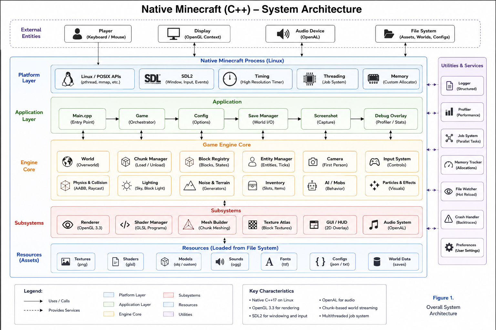

# Minecraft Linux Edition

A fully native Linux Minecraft implementation written in C++. Uses OpenGL for rendering, X11 for windowing, and has no dependency on a JVM, Wine, or any emulation layer. The engine runs the full game loop: world generation, chunk loading, entity AI, physics, crafting, enchanting, and the complete GUI stack.


---

## Features

- Full world generation — overworld, Nether, and The End with 30+ biomes
- 100+ block types with correct simulation (redstone, pistons, water flow, fire spread)
- Entity AI — animals, monsters, villagers, bosses (Ender Dragon, Wither)
- Survival and Creative modes
- Crafting, smelting, enchanting, brewing
- Multiplayer — local split-screen and LAN via the built-in authoritative server
- Complete GUI — inventory, chests, crafting table, furnace, enchanting table, anvil, maps
- Day/night cycle, weather, lighting engine
- NBT-based save format with chunk compression
- Headless server mode — runs the world with no window, logs to stdout

---

## What's in this repo

```
Minecraft.World/            Game engine — logic only, no rendering
  *.cpp / *.h               ~1,500 files: blocks, entities, biomes, physics,
                            world gen, NBT, packets, AI, crafting, enchanting
Minecraft.Client/           Client-side code
  Common/                   Platform-neutral: GUI, audio, game rules, network,
                            DLC, tutorials, UI scenes, XUI framework
  *.cpp / *.h               Renderers, models, screens, input, texture packs
compat/                     Platform abstraction layer
  win_threads.cpp           Thread and synchronisation APIs → std::thread/mutex
  win_files.cpp             File and directory APIs → POSIX
  win_compat.cpp            Timing, string utils, miscellaneous stubs
  win_types.h               Internal type definitions
  msvc_compat.h             Compiler compatibility macros
port-src/                   Linux entry points
  gl_engine.cpp / .h        Engine bridge: world init, chunk meshing, tick loop
  gl_main.cpp               X11/GLX window, XInput2 mouse, PNG loader, renderer
  headless_server_main.cpp  Headless authoritative server (no window)
  stubs/                    Link stubs for subsystems not used on Linux
Common/res/                 Runtime assets loaded at startup
  terrain.png               Block texture atlas
  font/                     Bitmap fonts
  gui/                      HUD, inventory, and screen textures
  mob/                      Entity skin textures
CMakeLists.txt              Top-level build file
CMakeLists.linux.cmake      Linux build configuration
toolchain-linux.cmake       GCC toolchain + LINUX_PORT flag
play.sh                     Launcher script
```

---

## System requirements

| | |
|---|---|
| OS | 64-bit Linux with X11 |
| GPU | OpenGL 3.3 or newer (Mesa, NVIDIA, AMD) |
| RAM | 512 MB minimum, 1 GB recommended |
| Compiler | GCC 9+ or Clang 10+ |
| CMake | 3.16+ |
| Libraries | `libGL`, `libX11`, `libXi`, `libpng`, `zlib`, `pthread` |

---

## Building from source

### 1 — Install dependencies

**Ubuntu / Debian / Mint**
```bash
sudo apt update
sudo apt install -y \
    build-essential cmake git \
    libgl-dev libx11-dev libxi-dev \
    libpng-dev zlib1g-dev
```

**Fedora / RHEL**
```bash
sudo dnf install -y \
    gcc-c++ cmake git \
    mesa-libGL-devel libX11-devel libXi-devel \
    libpng-devel zlib-devel
```

**Arch / Manjaro**
```bash
sudo pacman -S --needed \
    base-devel cmake git \
    mesa libx11 libxi \
    libpng zlib
```

---

### 2 — Clone

```bash
git clone https://github.com/tamim1089/minecraft-native-linux.git
cd minecraft-native-linux
```

---

### 3 — Configure

```bash
cmake -S . -B build-linux -DCMAKE_TOOLCHAIN_FILE=toolchain-linux.cmake
```

`toolchain-linux.cmake` sets `LINUX_PORT=ON`, which switches `CMakeLists.txt` to the Linux-specific configuration in `CMakeLists.linux.cmake`. It also selects GCC and enforces C++14.

What the configuration does:
- **C++14** — required. C++17 introduces `std::byte` which conflicts with the engine's `typedef unsigned char byte`. The build will fail with thousands of ambiguous-symbol errors if you use C++17.
- **Force-includes** `compat/msvc_compat.h` and `compat/win_types.h` into every translation unit. These define the internal platform types the engine uses (`DWORD`, `BOOL`, `HANDLE`, etc.) so nothing needs to be changed in the source files.
- **`-fpermissive`** — GCC rejects some constructs the engine relies on (implicit int-to-enum conversions, forward-declared enums used before definition). This flag turns those into warnings instead of errors.
- **`-fno-strict-aliasing`** — the engine casts between unrelated pointer types in several places. Without this, GCC may miscompile those under strict-aliasing optimisation rules.
- **Defines** `_LINUX`, `_LARGE_WORLDS`, `UNICODE`, `_DEBUG`.

---

### 4 — Build

```bash
cmake --build build-linux -j$(nproc)
```

Two binaries are produced:

| Binary | Location | Description |
|---|---|---|
| `minecraft_gl` | `build-linux/minecraft_gl` | Full client with OpenGL window |
| `minecraft_headless` | `build-linux/minecraft_headless` | Server only, no window |

Build time is 3–5 minutes on a modern machine with `-j$(nproc)`. The build is silent by default (`-w` suppresses warnings during compilation).

---

### 5 — Run

The binary must be run from the **repo root** because the engine looks for `Common/res/` relative to the working directory.

```bash
./play.sh
```

`play.sh` sets `DISPLAY` and `cd`s to the correct directory automatically. You can also run directly:

```bash
DISPLAY=:0 ./build-linux/minecraft_gl
```

Headless server:

```bash
./build-linux/minecraft_headless
```

The headless server generates a world, runs a 20 Hz tick loop, and prints engine output to stdout. No window is opened.

---

## Controls

| Input | Action |
|---|---|
| `W` `A` `S` `D` | Move |
| Mouse | Look around |
| `Space` | Jump / swim up |
| `Shift` | Descend (fly mode) / sneak |
| `Ctrl` | Sprint |
| `F` | Toggle fly / walk |
| `1` – `9` | Select hotbar slot |
| Scroll wheel | Cycle hotbar |
| Left mouse button | Break block |
| Right mouse button | Place block / use item |
| `E` | Open inventory |
| `Esc` | Pause / back |

---



## How the engine is structured

The codebase is split into two static libraries that are linked into the final binary:

### Minecraft.World

Pure game logic with no rendering dependency. Contains:

- **World generation** — biome selection, terrain shaping, structure placement (villages, strongholds, mineshafts, temples), tree and ore generation
- **Chunk system** — `LevelChunk`, `ServerChunkCache`, region file storage, chunk compression (RLE and zlib)
- **Block simulation** — tile ticking, redstone signal propagation, piston movement, water and lava flow, fire spread, crop growth
- **Entities** — ~60 entity types including all mobs, projectiles, vehicles, and dropped items. Each has its own AI goal system (pathfinding, attack, flee, breed, trade)
- **Physics** — AABB collision, gravity, knockback
- **Inventory and items** — container menus, crafting recipes, smelting, enchanting (all enchantment types implemented), potion brewing
- **NBT** — full read/write implementation for save data
- **Packets** — the full client/server packet protocol (~80 packet types)
- **Save format** — versioned binary save file with per-chunk compression

### Minecraft.Client

Contains everything that deals with rendering, input, GUI, and the platform-facing application shell:

- **Renderers** — one renderer class per entity/tile type, plus `LevelRenderer` for chunk geometry, `GameRenderer` for the main scene, `ParticleEngine` for particles
- **GUI system** — all in-game screens (inventory, crafting, chest, furnace, enchanting, map, pause, options, title screen) implemented using the XUI/Flash-based UI framework
- **Input** — keyboard and gamepad handling, key mappings
- **Texture system** — texture atlas stitching, animated textures, texture pack support
- **Audio** — stub implementation; sound event hooks are in place throughout the engine
- **Multiplayer** — `ClientConnection`, `ServerConnection`, `PlayerList`, `GameNetworkManager`

### compat/

The engine internally uses a set of threading, file, and utility APIs that are mapped to Linux equivalents here without modifying any engine source:

- `win_threads.cpp` — `CreateThread`, `WaitForSingleObject`, `SetEvent`, `CRITICAL_SECTION` → `std::thread`, `std::mutex`, `std::condition_variable`
- `win_files.cpp` — `FindFirstFile`, `FindNextFile`, `CreateFile`, `ReadFile`, `WriteFile`, `GetFileAttributes` → `opendir`, `readdir`, `open`, `read`, `write`, `stat`
- `win_compat.cpp` — `QueryPerformanceCounter`, `QueryPerformanceFrequency`, `MultiByteToWideChar`, `WideCharToMultiByte`, and other miscellaneous stubs

### port-src/

The Linux entry points:

- `gl_engine.cpp` — initialises the engine (`MinecraftWorld_RunStaticCtors`), generates the world from a fixed seed (`20240604`), runs the tick loop, handles chunk meshing, and exposes the engine state to the renderer
- `gl_main.cpp` — opens an X11/GLX window (1280×720), loads texture atlases from `Common/res/` using `libpng`, submits draw calls using OpenGL immediate mode, and processes input via XInput2 raw events for accurate FPS mouse look
- `headless_server_main.cpp` — same engine init and tick loop as above but with no window, no renderer, and no input. Useful for testing world gen and engine logic

---

## Save files

The engine stores world data in a binary format in a `saves/` directory under the repo root (created on first run). Save files are versioned — the current version is `SAVE_FILE_VERSION_COMPRESSED_CHUNK_STORAGE`. Chunks are stored with zlib or RLE compression depending on content.

The world seed is hardcoded to `20240604` in `port-src/gl_engine.cpp`. Change `initData.seed` and `Math::setRandomSeed()` to use a different seed. The spawn point is printed to stdout on startup: `[engine] world generated, spawn=(x,y,z)`.

---

## Project structure notes

**C++14 only.** The engine uses `typedef unsigned char byte` at global scope and `using namespace std;` widely. C++17's `std::byte` makes every unqualified `byte` ambiguous. Do not change `CMAKE_CXX_STANDARD`.

**Cyclic library dependency.** `Minecraft.World` and `Minecraft.Client` have symbols that reference each other. The linker command wraps both in `--start-group ... --end-group`, which tells the linker to make multiple passes until all symbols resolve.

**`-fpermissive` is intentional.** Without it the build fails on a handful of constructs that GCC is stricter about than other compilers. These are pre-existing issues in the engine code, not bugs introduced in the Linux build.

---

## Troubleshooting

**`cannot open display` / black window**

`DISPLAY` is not set or the X server is not accessible.

```bash
# If running on a physical machine or VM with a desktop:
echo $DISPLAY        # should print :0 or :1

# If running headless (no display at all), use Xvfb:
sudo apt install xvfb
Xvfb :99 -screen 0 1280x720x24 &
DISPLAY=:99 ./build-linux/minecraft_gl
```

**`[gl] missing Common/res/terrain.png` or similar**

The binary is not being run from the repo root. The engine resolves all asset paths relative to the working directory.

```bash
cd /path/to/minecraft-native-linux
./build-linux/minecraft_gl
# or just use:
./play.sh
```

**`undefined reference to ...` at link time**

A library is missing. The linker needs `libGL`, `libX11`, `libXi`, `libpng`, and `libz`. Install the `-dev` packages:

```bash
# Ubuntu/Debian
sudo apt install libgl-dev libx11-dev libxi-dev libpng-dev zlib1g-dev
```

**`error: ambiguous 'byte'` / hundreds of std::byte errors**

CMake is using C++17. Check that `CMAKE_TOOLCHAIN_FILE=toolchain-linux.cmake` is being passed and that no `CMakePresets.json` or environment variable is overriding `CMAKE_CXX_STANDARD`.

**Engine crashes on startup with a segfault**

Most likely cause is missing static constructors. The engine requires `MinecraftWorld_RunStaticCtors()` to be called before anything else. This is already done in both `gl_engine.cpp` and `headless_server_main.cpp`. If you are writing a custom entry point, call this first.

**World generates but no chunks render**

The chunk meshing thread may have failed silently. Check stdout for `[engine]` messages. If the spawn coordinates print correctly but no terrain appears, verify that `Common/res/terrain.png` is present and readable.

---

## Contributing

The codebase is large (~1,500 files in `Minecraft.World` alone) so it helps to understand the general flow before making changes:

1. `gl_engine.cpp:MinecraftWorld_Init()` — sets up the engine and generates the world
2. `ServerLevel::tick()` — the main 20 Hz game loop tick
3. `LevelChunk` — individual 16×16×128 chunk, holds block data and handles ticking
4. `gl_engine.cpp:MinecraftWorld_MeshDirtyChunks()` — walks dirty chunks and builds vertex arrays
5. `gl_main.cpp` — consumes those vertex arrays and submits them to OpenGL

For entity behaviour, each mob has a class in `Minecraft.World/` (e.g. `Zombie.cpp`, `Creeper.cpp`) with a goal list set up in the constructor. Goals are in files ending in `Goal.cpp`.

For GUI changes, screens are in `Minecraft.Client/Common/UI/` and use the XUI framework defined in `Minecraft.Client/Common/XUI/`.

---

## License

Source provided for educational and preservation purposes.
